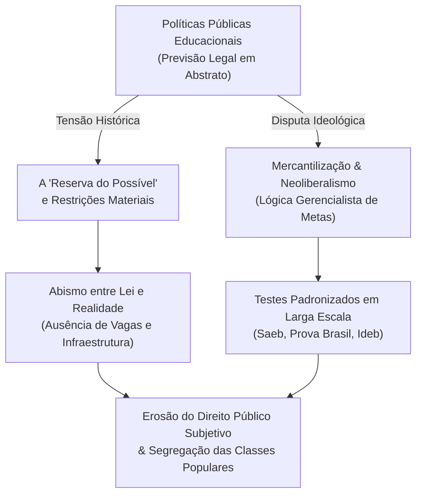
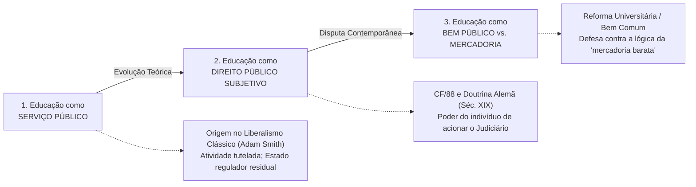

# Resumo Analítico: As Políticas Públicas e o Direito à Educação no Brasil: Uma Perspectiva Histórica

**Título do Artigo:** *As políticas públicas e o direito à educação no Brasil: uma perspectiva histórica*  
**Autores:** Celia Smarjassi (Doutora em Educação Escolar - Unesp e Ciências da Religião - PUC-SP) e Jose Henrique Arzani (Pedagogo - Unasp, Pós-graduado em Filosofia e Direitos Humanos - PUC-PR, Mestrando na Univ. de Turim)  
**Veículo de Publicação:** *Revista Educação Pública* (Fundação CECIERJ), v. 21, nº 15, 27 de abril de 2021  
**ISSN:** 1984-6290 | **Qualis CAPES (2020-2024):** B1 | **DOI:** 10-18264/REP  
**Epígrafe:** *"Nenhuma lei é capaz de ser corporificada se não for sinceramente criada"* (Friedrich Nietzsche)  

---

## 1. Visão Geral e Problematização Central

O artigo investiga a trajetória histórica da formulação e implementação das políticas públicas educacionais no Brasil, problematizando o abismo existente entre o **aparato legal formal** e a **materialização concreta (corporificação)** do direito à educação de qualidade social, em especial na Educação Básica.

Os autores partem da premissa de que as políticas públicas são instrumentos governamentais desenhados para efetivar os direitos constitucionais. Contudo, na história brasileira, a educação foi estruturada sob o signo da **segregação social e da incompletude**, marcada por:
1. **Culpabilização das vítimas:** A transferência da responsabilidade pelo fracasso escolar para os próprios estudantes das classes populares e suas famílias;
2. **Ausência de um Sistema Nacional de Educação (SNE):** Conforme apontado por Araújo (2011), o Brasil do século XXI ainda padece de profundas assimetrias regionais e estaduais que inviabilizam uma rede verdadeiramente coesa e igualitária;
3. **Contradição entre quantidade e qualidade:** A aparente universalização quantitativa do acesso ao Ensino Fundamental não se fez acompanhar de padrões mínimos de qualidade, mantendo o país em níveis educacionais inferiores inclusive quando comparado a outros vizinhos da América Latina.



---

## 2. Percurso Histórico-Normativo da Educação Brasileira

O texto traça uma linha evolutiva que demonstra como o Estado brasileiro historicamente tratou a educação a partir da premissa de que *"o mínimo era o bastante"* (Araújo, 2011):

| Período Histórico | Marco Legal / Evento | Características e Impactos no Direito à Educação |
| :--- | :--- | :--- |
| **Império (1824)** | Constituição Política de 1824 | Previa formalmente a instrução primária gratuita a todos os cidadãos, mas restringia-se ao ensino das primeiras letras. |
| **Império (1834)** | Ato Adicional de 1834 | **Descentralização precarizante:** Transferiu a responsabilidade da instrução primária às províncias, que não possuíam capacidade orçamentária nem técnica, inviabilizando o atendimento à população pobre. |
| **Primeira República (1889-1930)** | Constituição de 1891 e Reformas Sucessivas | Instituiu o federalismo sem articulação nacional. Oscilação entre centralização e descentralização que agravou disparidades. Sucessão de reformas parciais: Benjamin Constant (1890), Epitácio Pessoa (1901), Lei Orgânica de 1911, Reforma Maximiliano (1915) e Rocha Vaz (1925) (Nagle, 2001). |
| **Era Vargas (1930-1945)** | Ministério da Educação (1930) / Reforma Francisco Campos (1931) | Criação de órgãos estatais centrais e nacionalização do ensino secundário e superior sob o paradigma intervencionista e corporativista do Estado. |
| **Renovação Educacional (1932)** | *Manifesto dos Pioneiros da Educação Nova* | Movimento liderado por Anísio Teixeira e outros intelectuais em prol da escola pública, laica, gratuita, obrigatória e da criação de um **Sistema Nacional de Educação**. |
| **Constitucionalismo Social (1934)** | Constituição de 1934 | Primeiro texto com um capítulo exclusivo para a Educação, fixando competências da União para traçar diretrizes e elaborar o Plano Nacional de Educação (PNE). |
| **Desenvolvimentismo e Ditadura (1946-1969)** | LDB nº 4.024/1961 e Emenda Constitucional nº 1/1969 | A LDB nº 4.024/61 consagrou a educação como **serviço público**, cedendo à pressão da iniciativa privada e canalizando recursos públicos para escolas particulares (desfigurando o projeto público defendido por Anísio Teixeira). A Emenda de 1969 formalizou a expressão de que a educação é *"direito de todos e dever do Estado"*. |
| **Redemocratização (1988)** | Constituição Cidadã de 1988 | Consagrou a Educação como **Direito Social Fundamental (Art. 6º)** e como **Direito Público Subjetivo (Art. 208, § 1º)**, vinculando o Estado e a família. |

---

## 3. As Três Concepções em Disputa: Serviço, Direito Público Subjetivo e Bem Público

Um dos eixos teóricos mais ricos do artigo (apoiado em Araújo & Cassini, 2017 e Duarte, 2004) reside na distinção epistemológica e jurídica entre três categorias frequentemente confundidas:



### 3.1. Educação como Serviço Público
* **Gênese:** Remonta ao liberalismo clássico de Adam Smith, que admitia a educação como atividade de interesse geral necessária para evitar as degenerações do trabalho fabril, porém sem defender o monopólio estatal de sua provisão. O Estado guia e regula, mas a prestação pode ocorrer pelo setor privado ou restringir-se ao patamar mínimo de utilidade econômica.
* **Limitação Histórica no Brasil:** Durante décadas, a concepção de serviço público predominou (inclusive na LDB 4.024/61), tratando o ensino como mera prestação administrativa e assistencial do Estado, e não como um direito exigível pelo cidadão, o que facilitou a transferência de recursos públicos para entidades privadas e manteve as classes desfavorecidas desprotegidas.

### 3.2. Educação como Direito Público Subjetivo
* **Conceito Jurídico (Duarte, 2004):** Construção derivada da doutrina jurídica alemã do século XIX. Configura a prerrogativa legal e a capacidade outorgada ao indivíduo de transformar uma norma geral, abstrata e programática (direito objetivo da Constituição) em um poder jurídico concreto e acionável em proveito próprio (direito subjetivo).
* **Implicação Prática:** Permite ao cidadão, à família ou ao Ministério Público exigir perante o Poder Judiciário a prestação educacional imediata caso o Poder Público seja omisso.
* **O Obstáculo da "Reserva do Possível":** O artigo denuncia que a materialização do direito subjetivo é frequentemente bloqueada pelo Estado sob a justificativa fiscal de escassez orçamentária, transformando a garantia legal em promessa não cumprida.
* **A Advertência de Pontes de Miranda (apud Araújo & Cassini, 2017):**
  > *"A educação somente pode ser direito de todos se há escolas em número suficiente e se ninguém é excluído delas; portanto, se há direito público subjetivo à Educação, o Estado pode e tem de entregar a prestação educacional. Fora daí, é iludir com artigos de constituição ou de leis. Resolver o problema da educação não é fazer leis, ainda que excelentes; é abrir escolas, tendo professores e admitindo alunos."*

### 3.3. Educação como Bem Público versus a Mercantilização Neoliberal
* **O Risco da Mercantilização:** Os autores alertam para a penetração desenfreada do neoliberalismo na Educação Superior e Básica, transformando a formação humana em uma *"mercadoria barata"* (serviços de baixa qualidade ofertados a preços compatíveis no mercado privado).
* **Invasão da Rede Pública pelo Mercado:** A proliferação da compra de apostilas, materiais didáticos padronizados e consultorias privadas por prefeituras municipais, enfraquecendo a especificidade e a autonomia da escola pública.
* **O Conceito de Bem Público (PL nº 7.200/06):** Procura reafirmar a educação como bem imaterial de função social indissociável (ensino, pesquisa e extensão), exigindo gratuidade e controle de qualidade pelo poder público para não subordiná-la aos abusos mercantis.
* **Alerta Crítico Final:** Araújo e Cassini (2017) ressaltam que conceber a educação como bem público não pode obscurecer nem retroceder a conquista jurídica da escola pública única e do direito público subjetivo inalienável.

---

## 4. O Neoliberalismo e a Distorção Avaliativa: Metas e Testes Padronizados

Os autores estabelecem uma crítica incisiva à incorporação da cartilha gerencialista na gestão educacional brasileira:

1. **A Lógica dos Resultados Econômicos:** A partir das reformas de cunho neoliberal, o sistema educacional passou a ser governado por balizas regulatórias de controle (PDE, Saeb, Prova Brasil, Ideb e Enem).
2. **Redução da Função Social da Escola:** Esses testes padronizados em larga escala mensuram exclusivamente produtos e indicadores estatísticos frios, ignorando os percursos pedagógicos e as singularidades socioculturais.
3. **Crítica Pedagógica à Avaliação Classificatória (Cipriano Luckesi, 2006):**
   * Os instrumentos avaliativos elaborados sem contextualização introduzem elementos estranhos à realidade dos educandos, formulando questões em complexidades artificiais não compatíveis com as condições de ensino.
   * O resultado é uma avaliação excludente e punitiva, que viola os princípios da **Gestão Democrática** e as prescrições da **LDB nº 9.394/96**, impedindo que a educação cumpra sua meta maior de emancipação humana e cidadania ativa.

---

## 5. Principais Conclusões do Estudo

1. **Incompletude Histórica:** O direito à educação no Brasil seguiu uma trajetória tardia e truncada, na qual a legislação avançou na formalização abstrata, mas esbarrou no desfinanciamento, na omissão estatal e na tolerância estrutural à desigualdade social.
2. **A Lei não se Autoexecuta:** A existência de belas formulações legais e constitucionais é inócua se o Estado não garantir escolas em quantidade suficiente, infraestrutura digna, professores valorizados e vagas universais.
3. **Resistência ao Gerencialismo:** É imprescindível confrontar o avanço da lógica privatista e mercantil que converte o ato de educar em mero controle de metas e rankings quantitativos.
4. **Defesa do Direito Subjetivo Inalienável:** A verdadeira democratização da educação exige superar o argumento da "reserva do possível" e garantir a primazia do direito público subjetivo à escola pública, gratuita, laica e de qualidade social para toda a coletividade.

---

## 6. Ficha Bibliográfica (Normas ABNT)

```text
SMARJASSI, Celia; ARZANI, Jose Henrique. As políticas públicas e o direito à educação no Brasil: uma perspectiva histórica. Revista Educação Pública, v. 21, nº 15, 27 abr. 2021. Disponível em: https://educacaopublica.cecierj.edu.br/artigos/21/15/as-politicas-publicas-e-o-direito-a-educacao-no-brasil-uma-perspectiva-historica.
```
