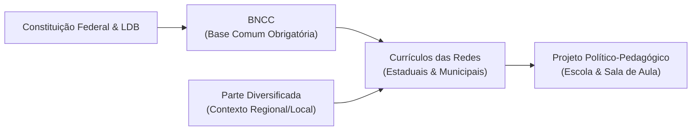

# Resumo Executivo da Base Nacional Comum Curricular (BNCC)

**Órgão Emissor:** Ministério da Educação (MEC) / Conselho Nacional de Educação (CNE)  
**Parceria:** CONSED (Conselho Nacional de Secretários de Educação) e UNDIME (União Nacional dos Dirigentes Municipais de Educação)  
**Versão Homologada Completa (com Ensino Médio):** 2018 | **Extensão:** 600 páginas  
**Natureza Jurídica:** Documento de caráter normativo (Resoluções CNE/CP nº 2/2017 e CNE/CP nº 3/2018)  
**Abrangência:** Todas as etapas e modalidades da Educação Básica no território nacional  

---

## 1. O que é a BNCC e qual o seu Papel?

A **Base Nacional Comum Curricular (BNCC)** é o documento de caráter normativo que define o conjunto orgânico e progressivo de **aprendizagens essenciais** que todos os alunos devem desenvolver ao longo da Educação Básica.

* **Base Legal:** CF/88 (Art. 210), LDB nº 9.394/96 (Art. 9º, IV e Art. 26), Diretrizes Curriculares Nacionais (DCN) e Plano Nacional de Educação – PNE 2014-2024 (Meta 7).
* **BNCC não é Currículo:** A BNCC define o *patamar comum obrigatório* (as aprendizagens essenciais). Cabe aos Estados, Municípios e escolas construir e adaptar seus currículos e propostas pedagógicas, agregando a **parte diversificada** exigida pelas características regionais, culturais, sociais e econômicas locais.
* **Pacto Interfederativo:** Articulação tripartite entre União, Estados, DF e Municípios para alinhamento da formação de professores, materiais didáticos (PNLD), infraestrutura e sistemas de avaliação (SAEB/ENEM).

---

## 2. Fundamentos Pedagógicos da BNCC

### A. Foco no Desenvolvimento de Competências
Na BNCC, **competência** é definida como:
> *"A mobilização de conhecimentos (conceitos e procedimentos), habilidades (práticas, cognitivas e socioemocionais), atitudes e valores para resolver demandas complexas da vida cotidiana, do pleno exercício da cidadania e do mundo do trabalho."*

Supera-se a memorização passiva de conteúdos enciclopédicos: o foco reside em **saber** e **saber fazer**, aplicando o conhecimento na prática social.

### B. O Compromisso com a Educação Integral
A Educação Integral na BNCC não se restringe à ampliação do tempo de permanência na escola (jornada estendida), mas refere-se à **formação e ao desenvolvimento humano global**. Abrange as dimensões intelectual, física, afetiva, social, cultural e ética, rompendo visões fragmentadas do educando.

### C. Igualdade e Equidade
* **Igualdade:** Assegurar a todos os estudantes os mesmos direitos de aprendizagem e patamar mínimo de qualidade.
* **Equidade:** Reconhecer que os pontos de partida dos estudantes e redes são desiguais. Exige tratamento diferenciado e alocação de recursos suplementares àqueles que mais necessitam, para garantir que as desigualdades socioeconômicas não determinem o fracasso escolar.

---

## 3. As 10 Competências Gerais da Educação Básica

As 10 competências gerais perpassam transversalmente toda a Educação Básica (Infantil, Fundamental e Médio):

1. **Conhecimento:** Valorizar e utilizar os conhecimentos historicamente construídos sobre o mundo físico, social, cultural e digital.
2. **Pensamento Científico, Crítico e Criativo:** Exercitar a curiosidade, investigar causas, testar hipóteses, formular e resolver problemas com rigor científico.
3. **Repertório Cultural:** Fruir e valorizar as manifestações artísticas e culturais, participando de produções artísticas diversas.
4. **Comunicação:** Utilizar diferentes linguagens (verbal, corporal, visual, sonora, digital, Libras) para partilhar ideias e produzir entendimentos.
5. **Cultura Digital:** Compreender, utilizar e criar tecnologias digitais de forma crítica, significativa, ética e autônoma.
6. **Trabalho e Projeto de Vida:** Entender o mundo do trabalho, fazer escolhas responsáveis e planejar o futuro alinhado à cidadania.
7. **Argumentação:** Argumentar com base em fatos, dados e evidências confiáveis, respeitando os direitos humanos e a consciência socioambiental.
8. **Autoconhecimento e Autocuidado:** Conhecer-se, apreciar-se e cuidar da saúde física e emocional, lidando com as próprias emoções.
9. **Empatia e Cooperação:** Exercitar o diálogo, a escuta, a mediação de conflitos e a valorização da diversidade sem preconceitos.
10. **Responsabilidade e Cidadania:** Agir pessoal e coletivamente com autonomia, responsabilidade, flexibilidade, ética e sustentabilidade.

---

## 4. Organização da BNCC por Etapas

### 4.1. Educação Infantil (0 a 5 anos e 11 meses)
* **Eixos Estruturantes:** As **Interações** e a **Brincadeira** (conforme DCNEI).
* **6 Direitos de Aprendizagem e Desenvolvimento:**
  1. *Conviver*
  2. *Brincar*
  3. *Participar*
  4. *Explorar*
  5. *Expressar*
  6. *Conhecer-se*
* **5 Campos de Experiências:**
  1. *O eu, o outro e o nós*
  2. *Corpo, gestos e movimentos*
  3. *Traços, sons, cores e formas*
  4. *Escuta, fala, pensamento e imaginação*
  5. *Espaços, tempos, quantidades, relações e transformações*
* **3 Grupos por Faixa Etária:**
  * Bebês (0 a 1 ano e 6 meses)
  * Crianças bem pequenas (1 ano e 7 meses a 3 anos e 11 meses)
  * Crianças pequenas (4 anos a 5 anos e 11 meses)

---

### 4.2. Ensino Fundamental (9 anos: 1º ao 9º ano)
Articula-se em **Anos Iniciais (1º ao 5º ano)** e **Anos Finais (6º ao 9º ano)**.

* **Foco dos Anos Iniciais:** Alfabetização consolidada nos 2 primeiros anos (1º e 2º ano), garantindo a apropriação do sistema alfabético e ortográfico e o letramento inicial.
* **Transição aos Anos Finais:** Ampliação da autonomia de estudos, maior abstração e contato com professores especialistas.
* **5 Áreas do Conhecimento e Componentes Curriculares:**
  1. **Linguagens:** Língua Portuguesa, Arte, Educação Física, Língua Inglesa (obrigatória a partir do 6º ano).
  2. **Matemática:** Matemática.
  3. **Ciências da Natureza:** Ciências.
  4. **Ciências Humanas:** História e Geografia.
  5. **Ensino Religioso:** Ensino Religioso (oferta obrigatória da escola e matrícula facultativa do aluno).
* **Matriz de Cada Componente:**  
  $$\text{Área} \longrightarrow \text{Competências Específicas} \longrightarrow \text{Unidades Temáticas} \longrightarrow \text{Objetos de Conhecimento} \longrightarrow \text{Habilidades}$$

---

### 4.3. Ensino Médio (3 anos)
Reformulado pela Lei nº 13.415/2017, com carga horária mínima total ampliada para 3.000 horas:
* **Formação Geral Básica (FGB):** Limitada a um teto máximo de **1.800 horas**, cobrindo competências e habilidades das 4 áreas:
  1. Linguagens e suas Tecnologias (Língua Portuguesa obrigatória nos 3 anos).
  2. Matemática e suas Tecnologias (Matemática obrigatória nos 3 anos).
  3. Ciências da Natureza e suas Tecnologias.
  4. Ciências Humanas e Sociais Aplicadas.
* **Itinerários Formativos (IF):** Mínimo de **1.200 horas**, com foco no aprofundamento em uma ou mais áreas ou na **Formação Técnica e Profissional (V Itinerário)**.
* **Eixos Estruturantes dos Itinerários:** Investigação Científica, Processos Criativos, Mediação e Intervenção Sociocultural, e Empreendedorismo.
* **Foco Pedagógico:** Construção do **Projeto de Vida**, autonomia e protagonismo juvenil.

---

## 5. Como Decodificar os Códigos Alfanuméricos da BNCC

A BNCC utiliza um sistema mnemônico de identificação dos objetivos e habilidades:

### Exemplo 1: Educação Infantil
$$\mathbf{EI}\mathbf{02}\mathbf{TS}\mathbf{01}$$
* **`EI`**: Etapa da Educação Infantil.
* **`02`**: Grupo por faixa etária (`01` = Bebês; `02` = Crianças bem pequenas; `03` = Crianças pequenas).
* **`TS`**: Campo de Experiências (`TS` = Traços, sons, cores e formas; `EO` = O eu, o outro e o nós; etc.).
* **`01`**: Número sequencial do objetivo de aprendizagem.

### Exemplo 2: Ensino Fundamental
$$\mathbf{EF}\mathbf{06}\mathbf{MA}\mathbf{04}$$
* **`EF`**: Ensino Fundamental.
* **`06`**: Ano letivo (`06` = 6º ano; para blocos, ex.: `67` = 6º e 7º anos; `15` = 1º ao 5º ano).
* **`MA`**: Componente Curricular (`MA` = Matemática; `LP` = Língua Portuguesa; `CI` = Ciências; `HI` = História; `GE` = Geografia; `AR` = Arte; `EF` = Educação Física; `LI` = Língua Inglesa; `ER` = Ensino Religioso).
* **`04`**: Número da habilidade dentro daquele ano e componente.

### Exemplo 3: Ensino Médio
$$\mathbf{EM}\mathbf{13}\mathbf{LGG}\mathbf{1}\mathbf{02}$$
* **`EM`**: Ensino Médio.
* **`13`**: Habilidade que pode ser desenvolvida a qualquer momento entre o 1º e o 3º ano.
* **`LGG`**: Área do conhecimento (`LGG` = Linguagens; `MAT` = Matemática; `CNT` = Ciências da Natureza; `CHS` = Ciências Humanas).
* **`1`**: Competência específica da área à qual a habilidade está vinculada (neste caso, competência 1).
* **`02`**: Número sequencial da habilidade.

### Estrutura Redacional da Habilidade:
Cada habilidade é descrita com:
1. **Verbo de Ação:** Explicita o processo cognitivo exigido (ex.: *identificar*, *comparar*, *analisar*, *diferenciar*).
2. **Objeto de Conhecimento:** Conceito ou conteúdo mobilizado (o *quê*).
3. **Modificador de Contexto:** Circunstâncias e condições da aplicação (o *como*, *onde* ou *para quê*).

---

## 6. Diretrizes de Avaliação e Desafios Práticos

1. **Avaliação Formativa e Processual:** A BNCC enfatiza que a avaliação deve verificar a mobilização das competências e habilidades em situações autênticas, e não apenas o acúmulo mecânico de dados. A avaliação serve para orientar as intervenções pedagógicas (função diagnóstica e formativa), em harmonia com o Art. 24 da LDB.
2. **Autonomia Docente e Escolar:** A BNCC não impõe métodos de ensino únicos nem livros didáticos específicos; a escolha metodológica pertence aos professores e às instituições no âmbito de seus Projetos Político-Pedagógicos (PPPs).
3. **Riscos a Evitar na Gestão Educacional:**
   * Reduzir a BNCC a um "cardápio" tecnicista de checagem burocrática de códigos.
   * Promover avaliações estritamente quantitativas que ignorem a realidade socioeconômica e a diversidade cultural dos alunos.
   * Implementar mudanças curriculares sem formação continuada efetiva em serviço para a equipe docente.
