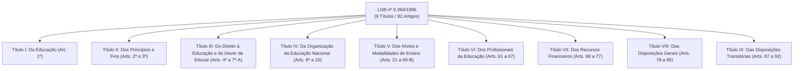
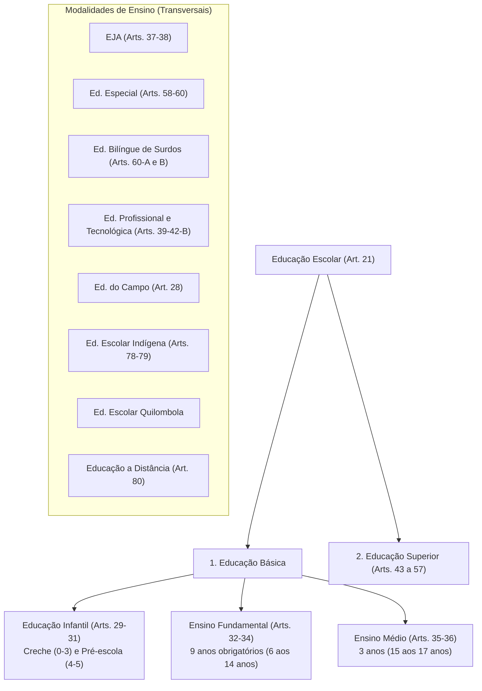

# Resumo Analítico e Exaustivo da Lei de Diretrizes e Bases da Educação Nacional (LDB nº 9.394/1996)

**Edição de Referência:** 7ª Edição Oficial do Senado Federal (Brasília, 2023)  
**Atualização Legislativa:** Atualizada até agosto de 2023 (incorporando Leis nº 14.191/2021, 14.533/2023, 14.644/2023 e 14.645/2023)  
**Diploma Legal:** Lei Federal nº 9.394, de 20 de dezembro de 1996  
**Estrutura Formal:** 9 Títulos, 92 Artigos, Disposições Transitórias e Capítulos/Seções Temáticas  

---

## 1. Visão Geral e Significado da LDB no Ordenamento Brasileiro

Conhecida como **Lei Darcy Ribeiro**, a LDB nº 9.394/1996 é a legislação infraconstitucional regulatória mestra da educação no Brasil. Ela regulamenta os mandamentos do Título VIII da Constituição Federal de 1988 (Artigos 205 a 214) e estabelece as diretrizes para a estruturação, o financiamento, a gestão, os níveis, as etapas, as modalidades e o exercício da profissão docente em todo o território nacional.

A 7ª edição do Senado Federal (2023) consolida marcos legislativos recentes e profundos que transformaram a educação brasileira nas últimas décadas, como a ampliação da obrigatoriedade dos 4 aos 17 anos (Lei 12.796/2013), a Reforma do Ensino Médio (Lei 13.415/2017), a criação da modalidade de Educação Bilíngue de Surdos (Lei 14.191/2021), a Política Nacional de Educação Digital (Lei 14.533/2023) e a instituição dos Conselhos Escolares e Fóruns dos Conselhos Escolares (Lei 14.644/2023).

---

## 2. Mapa Estrutural dos Nove Títulos da LDB

---

## TÍTULO I — Da Educação (Art. 1º)

* **Conceito Amplo de Educação (Art. 1º, caput):** A lei reconhece que a educação transcende a sala de aula, abrangendo os múltiplos processos formativos que ocorrem:
  1. Na vida familiar;
  2. Na convivência humana;
  3. No trabalho;
  4. Nas instituições de ensino e pesquisa;
  5. Nos movimentos sociais e organizações da sociedade civil;
  6. Nas manifestações culturais.
* **Objeto Específico da LDB (§ 1º):** A lei disciplina especificamente a **educação escolar**, desenvolvida predominantemente por meio do ensino em instituições próprias.
* **Vinculação Obrigatória (§ 2º):** A educação escolar deverá vincular-se organicamente a dois polos: **ao mundo do trabalho** e **à prática social**.

---

## TÍTULO II — Dos Princípios e Fins da Educação Nacional (Arts. 2º e 3º)

### Artigo 2º: Finalidades da Educação
Inspirada nos princípios de liberdade e nos ideais de solidariedade humana, é dever conjunto da **família e do Estado**, visando a:
1. Pleno desenvolvimento do educando;
2. Seu preparo para o exercício consciente da cidadania;
3. Sua qualificação para o trabalho.

### Artigo 3º: Os 14 Princípios Norteadores do Ensino
1. **Igualdade de condições** para o acesso e permanência na escola.
2. **Liberdade** de aprender, ensinar, pesquisar e divulgar a cultura, o pensamento, a arte e o saber.
3. **Pluralismo de ideias** e de concepções pedagógicas.
4. **Respeito à liberdade** e apreço à tolerância.
5. **Coexistência** de instituições públicas e privadas de ensino.
6. **Gratuidade do ensino público** em estabelecimentos oficiais.
7. **Valorização do profissional** da educação escolar.
8. **Gestão democrática** do ensino público, na forma da lei.
9. **Garantia de padrão de qualidade**.
10. **Valorização da experiência extraescolar**.
11. **Vinculação** entre a educação escolar, o trabalho e as práticas sociais.
12. **Consideração com a diversidade étnico-racial** (incluído pela Lei nº 10.639/2003).
13. **Garantia do direito à educação e à aprendizagem ao longo da vida** (incluído pela Lei nº 13.632/2018).
14. **Respeito à diversidade humana, linguística, cultural e identitária das pessoas surdas, surdo-cegas e com deficiência auditiva** (incluído pela Lei nº 14.191/2021).

---

## TÍTULO III — Do Direito à Educação e do Dever de Educar (Arts. 4º a 7º-A)

### Artigo 4º: As Obrigações do Estado
O dever do Estado com a educação escolar pública efetiva-se mediante a garantia de:
* **I - Educação Básica obrigatória e gratuita dos 4 aos 17 anos:** dividida em: *a) pré-escola; b) ensino fundamental; c) ensino médio*.
* **II - Educação infantil gratuita** às crianças de até 5 anos.
* **III - Atendimento Educacional Especializado (AEE)** gratuito aos estudantes com deficiência, TGD e altas habilidades/superdotação, de forma transversal e preferencialmente na rede regular.
* **IV - Acesso público e gratuito** aos ensinos fundamental e médio a todos que não os concluíram na idade própria (EJA).
* **V - Progressão a níveis superiores** de ensino, pesquisa e criação artística segundo a capacidade individual.
* **VI e VII - Ensino noturno regular** e oferta adequada às peculiaridades dos educandos trabalhadores.
* **VIII - Programas suplementares** em todas as etapas da educação básica: material didático-escolar, transporte, alimentação e assistência à saúde.
* **IX - Padrões mínimos de qualidade:** variedade e quantidade mínimas de insumos por aluno (mobiliário, equipamentos e material pedagógico adequado).
* **X - Vaga na escola pública mais próxima da residência** a toda criança a partir do dia em que completar 4 anos de idade.
* **XI - Alfabetização plena e capacitação gradual para a leitura** ao longo da educação básica como requisito para os demais direitos de aprendizagem (Lei nº 14.407/2022).
* **XII - Educação digital:** garantia de conectividade em alta velocidade para uso pedagógico e letramento digital (Lei nº 14.533/2023).
* **Art. 4º-A:** Atendimento educacional hospitalar ou domiciliar prolongado ao estudante internado para tratamento de saúde.

### Artigo 5º: O Direito Público Subjetivo
* O acesso à educação básica obrigatória é **direito público subjetivo**. Qualquer cidadão, grupo, associação, sindicato ou o **Ministério Público** pode acionar o Poder Judiciário para exigi-lo.
* O Poder Público tem o dever de: recensear anualmente a população escolar, fazer a chamada pública (*busca ativa*) e zelar pela frequência escolar junto aos responsáveis.
* O não oferecimento ou a oferta irregular pelo poder público importa responsabilidade da autoridade competente.

### Artigos 7º e 7º-A: Ensino Privado e Liberdade Religiosa
* **Art. 7º:** A iniciativa privada pode ministrar ensino desde que cumpra as normas nacionais, obtenha autorização e avaliação de qualidade pelo Poder Público e comprove capacidade de autofinanciamento.
* **Art. 7º-A:** Assegura ao estudante, por motivo de liberdade de consciência e de crença religiosa, o direito de ausentar-se de aulas ou provas em dias de guarda religiosa, devendo a instituição fornecer prestação alternativa (prova de reposição ou trabalho escrito) sem custo ao aluno (Lei nº 13.796/2019).

---

## TÍTULO IV — Da Organização da Educação Nacional (Arts. 8º a 20)

### 1. O Regime de Colaboração (Art. 8º)
A União, os Estados, o Distrito Federal e os Municípios organizarão seus respectivos sistemas de ensino em estreito regime de colaboração.
* **União (Art. 9º):** Coordena a política nacional de educação; exerce funções normativa, redistributiva e supletiva; elabora o PNE; presta assistência financeira e técnica aos demais entes; mantém o sistema federal de ensino superior e técnico; e assegura a avaliação nacional do rendimento escolar (SAEB, ENEM, SINAES).
* **Estados e DF (Art. 10):** Asseguram o Ensino Fundamental e oferecem, **com prioridade, o Ensino Médio**; assumem o transporte escolar de sua rede; e instituem os Conselhos Escolares.
* **Municípios (Art. 11):** Oferecem a Educação Infantil (creches e pré-escolas) e, **com prioridade, o Ensino Fundamental**; assumem o transporte escolar da rede municipal.

### 2. As Incumbências dos Estabelecimentos de Ensino (Escolas - Art. 12)
As unidades escolares, respeitadas as normas do sistema, possuem deveres intransferíveis:
1. Elaborar e executar sua proposta pedagógica (Projeto Político-Pedagógico - PPP);
2. Administrar seu pessoal e seus recursos materiais e financeiros;
3. Assegurar o cumprimento dos dias letivos e horas-aula estabelecidas;
4. Velar pelo cumprimento do plano de trabalho de cada docente;
5. **Prover meios para a recuperação dos alunos de menor rendimento;**
6. Articular-se com as famílias e a comunidade;
7. Informar pai e mãe (conviventes ou não) sobre a frequência, rendimento e execução da proposta pedagógica;
8. **Notificar ao Conselho Tutelar** a relação de estudantes com faltas acima de **30% do percentual permitido** (Lei nº 13.803/2019);
9. Promover medidas de conscientização, prevenção e combate a todos os tipos de violência, especialmente a intimidação sistemática (**bullying**);
10. Estabelecer ações para a **cultura de paz** e ambiente escolar seguro contra drogas;
11. Instituir o Conselho Escolar (Lei nº 14.644/2023).

### 3. As Incumbências dos Docentes (Art. 13)
* Participar da elaboração da proposta pedagógica da escola;
* Elaborar e cumprir plano de trabalho segundo a proposta pedagógica;
* **Zelar pela aprendizagem dos alunos;**
* **Estabelecer estratégias de recuperação para os alunos de menor rendimento;**
* Ministrar os dias letivos e horas-aula estabelecidos, além de participar integralmente dos períodos dedicados ao planejamento, à avaliação e ao desenvolvimento profissional;
* Colaborar com as atividades de articulação da escola com as famílias e a comunidade.

### 4. A Gestão Democrática e os Conselhos Escolares (Arts. 14 e 15)
A Lei nº 14.644/2023 introduziu avanços estruturais na gestão democrática do ensino público:
* **Art. 14:** Fixa como princípios a participação dos profissionais na elaboração do PPP e a participação das comunidades escolar e local em **Conselhos Escolares** e em **Fóruns dos Conselhos Escolares**.
  * **Composição Paritária do Conselho Escolar (§ 1º):** É órgão deliberativo composto pelo **Diretor da Escola** (membro nato) e por representantes eleitos pelos seus pares nas seguintes categorias:
    1. Professores, orientadores, supervisores e pedagogos;
    2. Servidores administrativos;
    3. Estudantes;
    4. Pais ou responsáveis;
    5. Membros da comunidade local.
  * **Fórum dos Conselhos Escolares (§ 2º):** Colegiado de caráter deliberativo regional/municipal voltado a integrar os conselhos e efetivar a democracia nas redes de ensino.
* **Art. 15:** Garante às unidades escolares graus progressivos de **autonomia pedagógica, administrativa e de gestão financeira**.

---

## TÍTULO V — Dos Níveis e Modalidades de Educação e Ensino (Arts. 21 a 60-B)

O Artigo 21 estabelece que a educação escolar brasileira compõe-se de apenas **dois níveis**:
1. **Educação Básica** (Educação Infantil, Ensino Fundamental e Ensino Médio);
2. **Educação Superior**.

---

### CAPÍTULO II: Da Educação Básica (Arts. 22 a 38)

#### 1. Disposições Gerais da Educação Básica (Arts. 22 a 28)
* **Finalidades (Art. 22):** Desenvolver o educando, assegurar-lhe a formação comum indispensável para o exercício da cidadania e fornecer-lhe meios para progredir no trabalho e em estudos posteriores.
* **Regras Comuns de Organização (Art. 24):**
  * **Carga horária:** Mínimo de **800 horas anuais**, distribuídas em pelo menos **200 dias de efetivo trabalho escolar** (excluído o tempo reservado aos exames finais).
  * **Classificação do aluno:** Pode ser feita por promoção (para quem cursou na própria escola), por transferência, ou independentemente de escolarização anterior, mediante avaliação feita pela escola.
  * **Frequência Escolar:** Mínimo de **75% do total de horas letivas** para aprovação.
* **O Mandamento da Avaliação Escolar (Art. 24, V, "a"):**
  > *"Avaliação contínua e cumulativa do desempenho do aluno, com **prevalência dos aspectos qualitativos sobre os quantitativos** e dos resultados ao longo do período sobre os de eventuais provas finais."*
  * Obrigatoriedade de estudos de **recuperação paralela**, preferencialmente ao longo do período letivo (Art. 24, V, "e").
* **Currículo da Educação Básica (Arts. 26 e 26-A):**
  * Deve ter uma **Base Nacional Comum (BNCC)** complementada por uma **parte diversificada** regional e local.
  * *Língua Portuguesa e Matemática* são obrigatórias em todos os anos da Educação Básica.
  * O ensino da *Arte* (abrangendo artes visuais, dança, música e teatro) e a *Educação Física* são componentes curriculares obrigatórios.
  * O ensino de *Língua Inglesa* é obrigatório a partir do 6º ano do Ensino Fundamental.
  * Obrigatoriedade do estudo da **História e Cultura Afro-Brasileira e Indígena** (Art. 26-A).
  * Inclusão de conteúdos voltados aos direitos humanos e prevenção da violência contra crianças e mulheres (Lei 14.164/2021).
  * Educação Digital integrada a todas as etapas (Art. 26, § 11 - Lei 14.533/2023).
* **Educação do Campo (Art. 28):** Adequação curricular, metodológica e calendário escolar às fases do ciclo agrícola e às condições climáticas da região rural.

---

#### 2. Educação Infantil (Arts. 29 a 31)
* **Finalidade:** Primeira etapa da Educação Básica, visa ao **desenvolvimento integral da criança de até 5 anos** em seus aspectos físico, psicológico, intelectual e social, complementando a ação da família e da comunidade.
* **Estrutura:** Creches (0 a 3 anos) e Pré-escolas (4 e 5 anos).
* **Regras de Avaliação e Organização (Art. 31):**
  * **Avaliação mediadora:** Mediante acompanhamento e registro do desenvolvimento da criança, **sem objetivo de promoção, mesmo para o acesso ao Ensino Fundamental**.
  * Carga horária mínima de 800 horas em 200 dias.
  * Jornada mínima de 4 horas diárias para turno parcial e 7 horas para jornada integral.
  * Controle de frequência mínima de **60%** na pré-escola.
  * Expedição de documentação comprobatória da trajetória de desenvolvimento da criança.

---

#### 3. Ensino Fundamental (Arts. 32 a 34)
* **Duração e Acesso:** Obrigatório e gratuito na escola pública, tem duração de **9 anos**, com ingresso aos **6 anos de idade**.
* **Objetivo Geral:** Formação básica do cidadão mediante:
  1. O desenvolvimento da capacidade de aprender, tendo como meios básicos o pleno domínio da leitura, da escrita e do cálculo;
  2. A compreensão do ambiente natural, social, político, tecnológico e dos valores éticos;
  3. O desenvolvimento da capacidade de aprendizagem, tendo em vista a aquisição de conhecimentos, habilidades e formação de atitudes;
  4. O fortalecimento dos vínculos de família, da solidariedade e da tolerância.
* **Modalidade de Ensino:** É prioritariamente presencial. O ensino a distância só é aceito como complementação ou em situações emergenciais.
* **Ensino Religioso (Art. 33):** Componente curricular dos horários normais das escolas públicas de ensino fundamental, de **matrícula facultativa** ao estudante e com proibição expressa de proselitismo religioso.
* **Jornada Escolar (Art. 34):** Pelo menos 4 horas de trabalho diário em sala, com ampliação progressiva para o regime de tempo integral.

---

#### 4. Ensino Médio (Arts. 35 e 36)
Etapa final da Educação Básica, com duração mínima de 3 anos:
* **Finalidades (Art. 35):** Consolidação dos conhecimentos fundamentais; preparação básica para o trabalho e para a cidadania; aprimoramento como pessoa humana (ética, autonomia intelectual e pensamento crítico); e domínio dos fundamentos científico-tecnológicos dos processos produtivos.
* **Novo Ensino Médio (Lei nº 13.415/2017):**
  * Carga horária ampliada progressivamente para **1.400 horas anuais** (totalizando 3.000 horas no triênio).
  * **Formação Geral Básica (FGB - Art. 35-A):** Balizada pela BNCC, com teto máximo de **1.800 horas** nas 4 áreas do saber (*Linguagens, Matemática, Ciências da Natureza e Ciências Humanas*). Apenas Língua Portuguesa e Matemática são de oferta obrigatória nos três anos.
  * **Itinerários Formativos (IF - Art. 36):** Carga mínima de **1.200 horas**, voltados ao aprofundamento acadêmico nas áreas ou na **Formação Técnica e Profissional**.
  * Foco pedagógico: Orientação para o **Projeto de Vida** e articulação com os anseios dos estudantes.

---

### MODALIDADES DE ENSINO NA LDB

#### A. Educação Profissional Técnica de Nível Médio (Arts. 36-A a 36-D)
Pode ser desenvolvida de forma:
* **Articulada:** 
  * *Integrada:* Na mesma instituição de ensino e com matrícula única, fundindo o ensino médio propedêutico e o técnico.
  * *Concomitante:* Matrículas distintas para cada curso, podendo ser na mesma instituição ou em instituições de ensino conveniadas.
* **Subsequente:** Destinada exclusivamente a quem já concluiu o Ensino Médio.

#### B. Educação de Jovens e Adultos - EJA (Arts. 37 e 38)
* Destinada àqueles que não tiveram acesso ou continuidade de estudos nos Ensinos Fundamental e Médio na idade própria.
* Os sistemas devem garantir oportunidades educacionais adequadas às características do trabalhador.
* **Idades Mínimas para Exames Supletivos e Certificação (§ 1º do Art. 38):**
  * **15 anos completos** para conclusão do Ensino Fundamental;
  * **18 anos completos** para conclusão do Ensino Médio.

#### C. Educação Profissional e Tecnológica (Arts. 39 a 42-B)
Abrange cursos de: Formação Inicial e Continuada (FIC) ou qualificação profissional; Educação Profissional Técnica de Nível Médio; e Educação Profissional Tecnológica de Graduação e Pós-Graduação (Lei nº 14.645/2023).

#### D. Educação Especial (Arts. 58 a 60)
* **Definição:** Modalidade escolar oferecida **preferencialmente na rede regular de ensino** para educandos com **deficiência**, **transtornos globais do desenvolvimento (TGD)** e **altas habilidades ou superdotação**.
* **Garantias (Art. 59):** Currículos, métodos e recursos específicos; professores com especialização ou capacitação adequada; terminalidade específica para aqueles que não puderem atingir o nível exigido; e aceleração para concluir em menor tempo o programa escolar para superdotados.
* A lei prevê a criação de um **cadastro nacional de alunos com altas habilidades/superdotação** (Art. 59-A).

#### E. Educação Bilíngue de Surdos (Arts. 60-A e 60-B - Lei nº 14.191/2021)
* **Nova Modalidade Independente:** Oferecida em Libras como primeira língua (L1) e em Língua Portuguesa escrita como segunda língua (L2).
* Abrange desde a Educação Infantil até a Educação Superior, em escolas bilíngues de surdos, classes bilíngues ou polos dedicados, garantindo a preservação da identidade cultural surda.

---

### CAPÍTULO IV: Da Educação Superior (Arts. 43 a 57)

* **Finalidades (Art. 43):** Estimular a criação cultural e o pensamento reflexivo; formar diplomados nas diferentes áreas; incentivar a pesquisa científica; promover a divulgação de conhecimentos; e prestar serviços à comunidade (extensão).
* **Cursos e Programas (Art. 44):** Cursos sequenciais por campo de saber; cursos de graduação (abertos a candidatos com ensino médio e classificados em vestibular/processo seletivo); pós-graduação (*lato sensu* - especializações; *stricto sensu* - mestrados e doutorados); e cursos de extensão.
* **Ano Letivo Superior (Art. 47):** Regularmente de no mínimo **200 dias de trabalho acadêmico efetivo**, excluído o tempo reservado a provas e exames finais. É obrigatória a frequência mínima de alunos e professores.
* **Universidades e Autonomia (Arts. 52 a 54):** Instituições pluridisciplinares de formação de quadros de nível superior que gozam de **autonomia didático-científica, administrativa e de gestão financeira**. Devem ter pelo menos um terço do corpo docente com titulação acadêmica de mestrado ou doutorado e um terço do corpo docente em regime de tempo integral.
* **Gestão Democrática nas IES Públicas (Art. 56):** Os órgãos colegiados deliberativos devem contar com pelo menos **70% de representação docente** em sua composição total, participando também estudantes e servidores técnicos.

---

## TÍTULO VI — Dos Profissionais da Educação (Arts. 61 a 67)

### 1. Quem são os Profissionais da Educação Básica (Art. 61)
1. Professores habilitados em nível médio ou superior para a docência;
2. Trabalhadores em educação portadores de diploma de Pedagogia (orientação, supervisão, administração escolar) ou mestrado/doutorado na área;
3. Trabalhadores em educação portadores de diploma de curso técnico ou superior em área pedagógica ou afim;
4. Profissionais com notório saber reconhecido pelos sistemas de ensino para docência na formação profissional técnica.

### 2. Formação e Exigências (Arts. 62 a 65)
* A formação docente para a Educação Básica far-se-á em **nível superior**, em curso de **licenciatura plena**.
* **Ressalva Histórica:** Admite-se como formação mínima para a docência na Educação Infantil e nos cinco primeiros anos do Ensino Fundamental a formação oferecida em **nível médio, na modalidade Normal** (Art. 62, caput).
* Prática de ensino obrigatória de no mínimo 300 horas nos cursos de licenciatura (Art. 65).
* A União, o DF, os Estados e os Municípios incentivarão a **formação continuada** e programas de pós-graduação para os docentes em exercício (Arts. 62-A e 62-B).
* A preparação para o magistério superior dar-se-á em nível de pós-graduação, prioritariamente em programas de mestrado e doutorado (Art. 66).

### 3. A Valorização do Magistério Público (Art. 67)
Os sistemas de ensino promoverão a valorização dos profissionais da educação através de estatutos e planos de carreira que garantam:
1. **Ingresso exclusivamente por concurso público de provas e títulos;**
2. **Aperfeiçoamento profissional continuado**, com licenciamento remunerado para capacitação;
3. **Piso salarial profissional nacional;**
4. Progressão funcional baseada na titulação e na avaliação do desempenho;
5. **Período reservado a estudos, planejamento e avaliação incluído na carga de trabalho semanal** (reserva de jornada de trabalho);
6. Condições adequadas de trabalho e infraestrutura.

---

## TÍTULO VII — Dos Recursos Financeiros (Arts. 68 a 77)

### 1. Percentuais Vinculados de Receita (Art. 69)
* **União:** Aplicará anualmente nunca menos de **18%** da receita resultante de impostos na MDE.
* **Estados, Distrito Federal e Municípios:** Aplicarão no mínimo **25%** da receita tributária (incluídas as transferências constitucionais) na MDE.

### 2. O que se Enquadra como MDE (Artigo 70) vs. O que NÃO é MDE (Artigo 71)

| Despesas Computadas como MDE (Art. 70) | Despesas que NÃO são de MDE (Art. 71) |
| :--- | :--- |
| **I -** Remuneração e aperfeiçoamento dos profissionais da educação. | **I -** Pesquisa não vinculada às instituições de ensino ou realizada fora delas. |
| **II -** Aquisição, manutenção, conservação e operação de prédios e instalações escolares. | **II -** Subvenção a entidades assistenciais, desportivas ou culturais. |
| **III -** Uso e conservação de bens e serviços vinculados ao ensino. | **III -** Programas suplementares de alimentação escolar (PNAE) e assistência médico-odontológica/psicológica. |
| **IV -** Levantamentos estatísticos, estudos e pesquisas sobre o ensino. | **IV -** Obras de infraestrutura externa (vias, saneamento, iluminação pública), ainda que beneficiem escolas. |
| **V -** Atividades-meio necessárias ao funcionamento das redes. | **V -** Pessoal docente e servidores em desvio de função ou em órgãos alheios à educação. |
| **VI -** Concessão de bolsas de estudo e financiamento a estudantes. | |

### 3. Padrão Mínimo e Ação Redistributiva (Arts. 74 a 77)
* A União e os Estados exercerão **ação supletiva e redistributiva** para equalizar as oportunidades educacionais e garantir padrão mínimo nacional de custo por aluno.
* Os recursos públicos são destinados prioritariamente às escolas públicas, admitindo repasses a escolas comunitárias, confessionais ou filantrópicas sem fins lucrativos que prestem contas ao Poder Público (Art. 77).

---

## TÍTULO VIII — Das Disposições Gerais (Arts. 78 a 86)

* **Educação Escolar Indígena (Arts. 78 e 79):** Ensino bilíngue, intercultural e comunitário, com recuperação de memórias históricas e preservação de línguas maternas e saberes ancestrais.
* **História Afro-Brasileira (Arts. 79-A e 79-B):** Inclusão do "Dia Nacional da Consciência Negra" (20 de novembro) no calendário escolar.
* **Educação a Distância (Art. 80):** O Poder Público incentivará a oferta e a pesquisa de EaD em todos os níveis e modalidades, cabendo à União a fixação dos requisitos de credenciamento.
* **Estágios (Art. 82):** O estágio de estudantes é ato educativo supervisionado, visando à preparação para o trabalho produtivo.
* **Concurso Público Obrigatório (Art. 85):** Qualquer cidadão habilitado tem o direito de exigir judicialmente a abertura de concurso público de provas e títulos para cargos vagos de magistério superior há mais de seis meses em instituições públicas.

---

## TÍTULO IX — Das Disposições Transitórias (Arts. 87 a 92)

* **Década da Educação (Art. 87):** Fixou prazos para que os entes federativos universalizassem o atendimento escolar, fizessem a chamada pública dos faltantes e exigissem que os professores da educação básica tivessem formação superior ou obtida em nível normal superior.
* **Cláusulas de Revogação (Art. 92):** Revogou formalmente a Lei nº 4.024/1961 e a Lei nº 5.692/1971, consolidando a vigência única da LDB nº 9.394/1996.

---

## 3. Síntese dos Artigos Críticos para a Prática e a Gestão Escolar

1. **Art. 24, V, "a" (Avaliação da Aprendizagem):** Prevalência obrigatória do qualitativo sobre o quantitativo e do processo contínuo sobre testes pontuais, com recuperação paralela imediata.
2. **Arts. 12 e 13 (Papel da Escola e do Professor):** A escola elabora e executa o PPP e notifica infrequência grave (30%); o professor participa da formulação da proposta, zela pela aprendizagem e estabelece estratégias para os alunos em defasagem.
3. **Arts. 14 e 15 (Gestão Democrática e Colegiados):** Obrigatoriedade da criação de Conselhos Escolares paritários (com representantes de professores, técnicos, alunos, pais e comunidade) e Fóruns dos Conselhos.
4. **Art. 26 (Currículo e Diversidade):** A articulação orgânica entre a base nacional obrigatória (BNCC) e as especificidades regionais e culturais da comunidade.
5. **Arts. 70 e 71 (Proteção do Orçamento Escolar):** Blindagem jurídica das verbas de MDE, impedindo que gastos com merenda, asfalto ou pessoal desviado sejam fraudados como despesa de ensino.
