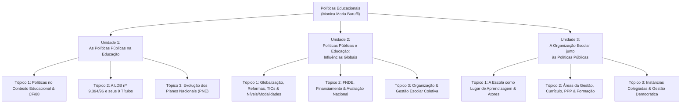
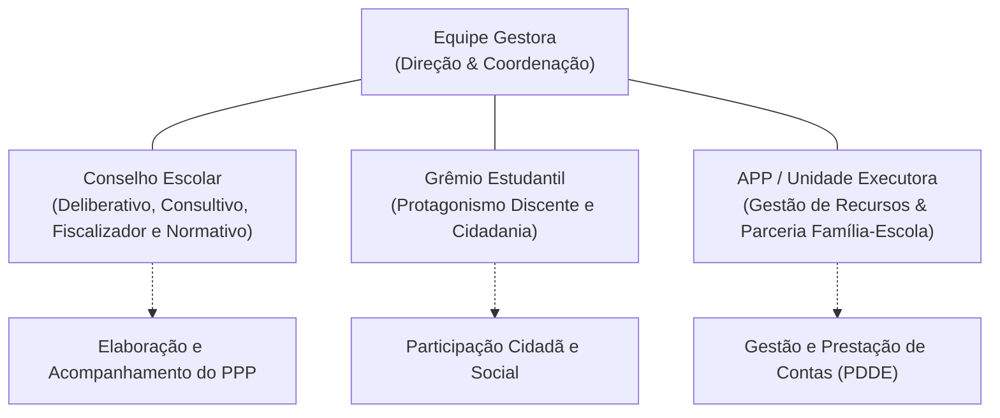

# Resumo Analítico da Obra: *Políticas Educacionais*

**Autora:** Prof.ª Monica Maria Baruffi  
**Edição:** 2ª Edição (2021) | **Páginas:** 245 p.  
**Instituição:** Centro Universitário Leonardo da Vinci – UNIASSELVI (Indaial/SC)  
**ISBN:** 978-65-5663-741-9 | **ISBN Digital:** 978-65-5663-742-6  
**Área:** Educação / Sistema Educacional Brasileiro / Políticas Públicas  

---

## 1. Visão Geral e Propósito da Obra

O livro didático *Políticas Educacionais*, elaborado pela Profa. Monica Maria Baruffi para a UNIASSELVI, constitui o material-base formativo para educadores e pedagogos. A obra oferece uma reflexão sistemática e aprofundada sobre a gênese, formulação, marcos legais, modelos de gestão e a execução das políticas educacionais no Brasil.

A tese central da obra articula-se em torno da premissa de que a educação escolar não ocorre em isolamento social: ela expressa as correlações de forças políticas, os interesses econômicos, as demandas da sociedade civil organizada e as diretrizes multilaterais em âmbito global. O livro estrutura uma trajetória contínua que parte dos fundamentos normativo-constitucionais (Unidade 1), avança pela internacionalização, reformas neoliberais, modalidades de ensino e políticas federais de financiamento e avaliação (Unidade 2), até alcançar o cotidiano da escola e os mecanismos colegiados de gestão democrática (Unidade 3).

---

## 2. Mapa Estrutural da Obra

---

## UNIDADE 1 — As Políticas Públicas na Educação

### Tópico 1: Políticas Públicas no Contexto Educacional

#### 1.1 Conceito e Historicidade das Políticas Públicas
- **Etimologia e Filosofia:** A palavra *política* origina-se na Grécia Antiga (*pólis*). Teve em Platão e Aristóteles seus primeiros teóricos, definindo-a como o conjunto de ações e debates necessários para organizar a vida social e buscar o bem comum.
- **Definição Contemporânea:** Com base em Santos (2014) e Marinho (2006), políticas públicas são ações, programas, diretrizes e planos gerados na esfera do Estado com o objetivo de responder a demandas sociais, atingindo a sociedade em sua totalidade ou em grupos específicos. São a tradução legal e prática da responsabilidade do Estado para com os direitos da população.
- **Atores do Cenário Político (Caldas, 2008):**
  - **Atores Estatais:** Agentes eleitos (Poderes Executivo e Legislativo) e burocratas/servidores públicos (que operam a máquina estatal com estabilidade funcional e capacidade técnica).
  - **Atores Privados / Sociedade Civil:** Associações da Sociedade Civil Organizada (SCO), sindicatos de trabalhadores e patronais, movimentos sociais, centros de pesquisa, imprensa e grupos de interesse.

#### 1.2 O Ciclo das Políticas Públicas (Caldas, 2008)
O livro detalha as cinco fases constitutivas que compõem o ciclo de qualquer política pública:
1. **Formação da Agenda (*Agenda-Setting*):** Seleção de prioridades; momento em que determinados problemas sociais ganham relevância e emergem para a consideração dos formuladores estatais.
2. **Formulação de Políticas:** Apresentação de alternativas, discussão de viabilidade técnica, econômica e administrativa, e avaliação de riscos e impactos sociais.
3. **Tomada de Decisão:** Escolha da alternativa governamental definitiva, consubstanciada em normas jurídicas (leis, decretos, portarias), alocação orçamentária e definição de prazos. Pode ter caráter aberto (participativo) ou fechado (tecnocrático).
4. **Implementação:** Execução concreta das ações desenhadas pela administração pública, sistemas de ensino e equipes escolares.
5. **Avaliação:** Análise permanente e retroalimentadora da eficácia, eficiência, relevância e sustentabilidade das medidas adotadas.

#### 1.3 A Constituição Federal de 1988 e a Ordem Social da Educação
A Carta de 1988 consagrou a educação como direito humano fundamental e público subjetivo no **Título VIII (Da Ordem Social), Capítulo III, Seção I (Artigos 205 a 214)**:
- **Artigo 205:** A educação é *“direito de todos e dever do Estado e da família, será promovida e incentivada com a colaboração da sociedade, visando ao pleno desenvolvimento da pessoa, seu preparo para o exercício da cidadania e sua qualificação para o trabalho”* (MACHADO; CUNHA, 2016).
- **Artigo 206 (Princípios Constitucionais do Ensino):**
  1. Igualdade de condições para o acesso e permanência na escola.
  2. Liberdade de aprender, ensinar, pesquisar e divulgar o pensamento, a arte e o saber.
  3. Pluralismo de ideias e de concepções pedagógicas.
  4. Coexistência de instituições públicas e privadas de ensino.
  5. Gratuidade do ensino público em estabelecimentos oficiais.
  6. Valorização dos profissionais da educação escolar (planos de carreira, concurso público de provas e títulos).
  7. Gestão democrática do ensino público, na forma da lei.
  8. Garantia de padrão de qualidade.
  9. Piso salarial profissional nacional (incluído pela EC 53/2006).
- **Artigo 207:** Autonomia didático-científica, administrativa e de gestão financeira das universidades, obedecendo ao princípio da **indissociabilidade entre ensino, pesquisa e extensão**.
- **Artigo 212 (Vinculação Constitucional de Receitas):** Mecanismo que impede a descontinuidade do financiamento educacional:
  - **União:** destina anualmente, no mínimo, **18%** da receita resultante de impostos.
  - **Estados, Distrito Federal e Municípios:** aplicam, no mínimo, **25%** de suas receitas tributárias na manutenção e desenvolvimento do ensino (MDE).
- **Artigo 214:** Fixa a obrigatoriedade de elaboração do Plano Nacional de Educação (PNE) plurianual/decenal em regime de colaboração federativa.

---

### Tópico 2: A Lei de Diretrizes e Bases da Educação Nacional (LDB nº 9.394/1996)

#### 2.1 Historicidade e Construção da LDB
- **Antecedentes:** A primeira LDB (Lei nº 4.024/1961) demandou 13 anos de tramitação, marcada por impasses entre privatistas e defensores da escola pública; a segunda LDB (Lei nº 5.692/1971), promulgada sob o regime autoritário, reformou o ensino de 1º e 2º graus com foco tecnicista e profissionalizante obrigatório.
- **A LDB nº 9.394/1996:** Promulgada em 20 de dezembro de 1996 (Lei Darcy Ribeiro), foi construída ao longo de oito anos em três grandes blocos de debate parlamentar (conforme Moaci Alves Carneiro): as discussões constituintes (Bloco 1), o projeto popular de Florestan Fernandes e entidades científicas (Bloco 2) e o substitutivo do senador Darcy Ribeiro com apoio do MEC (Bloco 3). É considerada por Santos (2012) *“a maior de todas as políticas públicas regulatórias”* do país.

#### 2.2 Análise Sistemática dos Nove Títulos da LDB/96

| Título | Denominação | Escopo e Artigos | Conteúdo Normativo e Implicações Práticas |
| :--- | :--- | :--- | :--- |
| **Título I** | Da Educação | Art. 1º | Define que a educação abrange processos formativos na vida familiar, convivência humana, trabalho, instituições de ensino, movimentos sociais e culturais. A lei disciplina especificamente a *educação escolar*. |
| **Título II** | Dos Princípios e Fins da Educação Nacional | Arts. 2º e 3º | Reitera a educação como dever do Estado e da família; consolida os princípios pedagógicos da CF/88 e a vinculação da escola ao mundo do trabalho e à prática social. |
| **Título III** | Do Direito à Educação e do Dever de Educar | Arts. 4º a 7º | Estabelece a obrigatoriedade da Educação Básica dos 4 aos 17 anos (após Lei 12.796/13); dever do Estado na oferta gratuita de AEE, merenda, transporte, livros didáticos e assistência à saúde; direito público subjetivo. |
| **Título IV** | Da Organização da Educação Nacional | Arts. 8º a 20 | Estrutura o **Regime de Colaboração** federativo: competências da União (art. 9º - coordenação nacional, avaliação, supletiva/redistributiva), Estados (art. 10 - Ensino Médio prioritário) e Municípios (art. 11 - Ed. Infantil e Fundamental). Define as atribuições dos estabelecimentos de ensino (art. 12 - elaborar o PPP) e dos docentes (art. 13). |
| **Título V** | Dos Níveis e das Modalidades de Educação e Ensino | Arts. 21 a 60 | Divide a educação em dois níveis: **Educação Básica** (Infantil, Fundamental de 9 anos e Médio) e **Educação Superior** (art. 43 a 57). Regula as modalidades de ensino: EJA (arts. 37-38), Educação Especial (arts. 58-60) e Educação Profissional Técnica (arts. 39-42). |
| **Título VI** | Dos Profissionais da Educação | Arts. 61 a 67 | Delimita quem são os profissionais da educação básica; estabelece a formação docente em nível superior (licenciaturas), mantida a aceitação de nível médio/Normal para educação infantil e anos iniciais; regulamenta a valorização da carreira e a **formação continuada**. |
| **Título VII** | Dos Recursos Financeiros | Arts. 68 a 77 | Regula as receitas públicas vinculadas à educação (art. 69: 18% União, 25% Estados/DF/Municípios); discrimina despesas computadas como MDE (art. 70) e as vedações (art. 71); estipula ação redistributiva da União para assegurar padrão mínimo nacional. |
| **Título VIII** | Das Disposições Gerais | Arts. 78 a 86 | Normatiza a Educação Escolar Indígena intercultural e bilíngue (arts. 78-79), o incentivo à Educação a Distância (art. 80), estágios profissionais supervisionados (art. 82) e a obrigatoriedade de concurso público (art. 85). |
| **Título IX** | Das Disposições Transitórias | Arts. 87 a 92 | Cria a "Década da Educação" (1997-2007) para universalização do atendimento e profissionalização de docentes leigos. |

---

### Tópico 3: A Educação Brasileira, sua Organização e Relação com os Planos Nacionais

#### 3.1 Histórico do Planejamento Educacional no Brasil
- **1932:** *Manifesto dos Pioneiros da Educação Nova*, marco inaugural que exigiu do Estado brasileiro um planejamento científico e a escola pública universal.
- **1962:** Primeiro Plano Nacional de Educação formulado no seio do Conselho Federal de Educação sob coordenação de Anísio Teixeira, interrompido pela ditadura de 1964.
- **1990:** *Conferência Mundial sobre Educação para Todos* (Jomtien, Tailândia), induzida pelo Banco Mundial, UNESCO, UNICEF e PNUD, criando o compromisso do decênio para os países populosos do Sul (E-9), desdobrando-se no Plano Decenal brasileiro de 1993.

#### 3.2 O PNE 2001-2010 (Lei nº 10.172/2001)
Formulado no governo FHC via INEP/MEC, fixou quatro grandes objetivos:
1. Elevação do nível global de escolaridade da população.
2. Melhoria da qualidade do ensino em todos os níveis.
3. Redução das assimetrias sociais e regionais de acesso e permanência com sucesso.
4. Democratização da gestão escolar.
*Crítica da obra:* O plano sofreu vetos presidenciais que retiraram a obrigatoriedade de investimento de 7% do PIB na educação, inviabilizando materialmente várias metas.

#### 3.3 Transição Governamental e o PNE 2014-2024 (Lei nº 13.005/2014)
- **Governo Lula (2003-2010):** Programa *"Uma Escola do Tamanho do Brasil"*, instituindo três diretrizes: democratização do acesso e permanência, qualidade social e regime de colaboração com gestão democrática. Em 2007, consolida-se o Plano de Desenvolvimento da Educação (PDE) e o Índice de Desenvolvimento da Educação Básica (IDEB).
- **PNE 2014-2024:**
  - Composto por **20 Metas** articuladas em quatro eixos: garantia da Educação Básica, redução das desigualdades e inclusão, expansão e qualidade da Educação Superior, e valorização dos profissionais associada ao investimento de **10% do PIB** em educação pública.
  - *Diagnóstico da autora:* Nenhuma das metas com prazo inicial previsto para 2015 e 2016 foi plenamente atingida em virtude de crises fiscais, ausência de sanções legais e descontinuidade de repasses federais.

---

## UNIDADE 2 — Políticas Públicas e Educação: Influências Globais

### Tópico 1: Influências Globais, Sociedade da Informação e Níveis/Modalidades

#### 1. Globalização e as Reformas Educativas Neoliberais
A partir dos anos 1990, o processo de globalização subordinou as políticas educacionais dos países periféricos às diretrizes de organismos financeiros internacionais (Banco Mundial, FMI, OCDE, UNESCO):
- A educação passa a ser concebida como alavanca econômica e mecanismo de formação de capital humano e alívio da extrema pobreza.
- Introdução de conceitos gerenciais no setor público: mensuração por resultados quantitativos, responsabilização dos agentes locais (*accountability*) e descentralização operacional com centralização do controle avaliativo.

#### 2. A Revolução Informacional e as TICs no Ensino
Conforme Libâneo, Oliveira e Toschi (2012):
- A revolução digital e a cibercultura alteram as formas de sociabilidade, a linguagem e o acesso ao conhecimento.
- A escola deixa de ser detentora do monopólio da informação, demandando do docente novas competências metodológicas e mediadoras, garantindo que as tecnologias promovam a emancipação crítica em vez da mera reprodução passiva.

#### 3. Níveis de Ensino vs. Modalidades de Educação (LDB/96)
- **Níveis de Ensino (Graus Sequenciais):**
  1. *Educação Básica:* Educação Infantil (creche até 3 anos; pré-escola de 4 a 5 anos), Ensino Fundamental obrigatório de 9 anos (anos iniciais e finais) e Ensino Médio de 3 anos.
  2. *Educação Superior:* Cursos sequenciais, de graduação (bacharelados, licenciaturas e cursos superiores de tecnologia), pós-graduação e extensão.
- **Modalidades de Ensino (Modos Específicos de Realização):**
  1. *Educação de Jovens e Adultos (EJA):* Para quem não teve acesso ou continuidade na idade própria (exames supletivos a partir de 15 anos para o fundamental e 18 anos para o médio).
  2. *Educação Especial:* Transversal a todos os níveis, voltada a educandos com deficiência, transtornos globais do desenvolvimento (TGD) e altas habilidades/superdotação, preferencialmente na rede regular.
  3. *Educação Profissional e Tecnológica:* Integrada, concomitante ou subsequente ao Ensino Médio.
  4. *Educação Básica do Campo:* Valorização dos saberes da terra e da pedagogia da alternância.
  5. *Educação Escolar Indígena:* Bilíngue e intercultural.
  6. *Educação Escolar Quilombola:* Afirmação das raízes étnico-raciais e combate ao racismo estrutural.
  7. *Educação a Distância (EaD):* Mediação tecnológica nos termos do art. 80.

#### 4. A Base Nacional Comum Curricular (BNCC)
- Documento normativo que estabelece as aprendizagens essenciais para a Educação Básica, norteado pelo princípio da **Educação Integral** (cognitiva, socioemocional, física e cidadã).
- Estruturada a partir de competências gerais e habilidades progressivas, exigindo dos sistemas de ensino e das escolas a adequação de seus currículos locais respeitando a diversidade regional.

---

### Tópico 2: As Instituições Formadoras e Instrumentos do Sistema Educacional Brasileiro

#### 1. O Fundo Nacional de Desenvolvimento da Educação (FNDE)
Autarquia federal responsável pelo custeio e execução dos grandes programas de sustentação da rede pública:
- **PNLD:** Distribuição gratuita de livros didáticos e materiais pedagógicos.
- **PNAE:** Alimentação escolar nutritiva universal (com destinação obrigatória de recursos à agricultura familiar).
- **Caminho da Escola:** Padronização e fomento do transporte escolar em áreas de difícil acesso.
- **PDDE:** Transferência direta de recursos financeiros às escolas (via Caixa Escolar/APP) para reparos e materiais didáticos de pronta necessidade.
- **Formação pela Escola:** Capacitação a distância para o controle social dos recursos públicos da educação.

#### 2. Do FUNDEF ao FUNDEB
- **FUNDEF (1996-2006):** Fundo contábil estadual focado no Ensino Fundamental.
- **FUNDEB (Lei nº 11.494/2007 e EC nº 108/2020):** Fundo permanente de equalização que abrange toda a Educação Básica (creche ao ensino médio e modalidades), distribuindo os recursos de acordo com o número de alunos do Censo Escolar e aportando complementação da União às regiões com menor capacidade fiscal.

#### 3. Programas Federais de Acesso e Democratização
- **PRONATEC (Lei nº 12.513/2011):** Expansão do ensino técnico integrado e cursos profissionalizantes.
- **PROUNI (Lei nº 11.096/2005):** Concessão de bolsas integrais e parciais (50%) a estudantes de baixa renda em instituições privadas de ensino superior.
- **FIES:** Financiamento público subsidiado de cursos superiores privados.

#### 4. Sistemas e Mecanismos Nacionais de Avaliação
- **SAEB / Prova Brasil:** Avaliações padronizadas externas aplicadas periodicamente em larga escala.
- **IDEB:** Índice sintético (0 a 10) que combina proficiência em Língua Portuguesa/Matemática com taxas de aprovação/fluxo escolar.
- **ENEM:** Instrumento avaliativo de fim de ciclo que se tornou o principal mecanismo nacional de acesso ao ensino superior (via SiSU).
- **SINAES (Lei nº 10.861/2004):** Sistema que congrega a avaliação institucional, a avaliação de cursos e o **ENADE**, que mede o rendimento dos estudantes de graduação.

---

### Tópico 3: A Organização e Gestão Escolar Coletiva

#### 1. Conceito de Organização e Gestão (Libâneo, Oliveira e Toschi, 2012)
- **Organização Escolar:** Sistema sociotécnico e humano constituído pela infraestrutura, arranjos didáticos e condições materiais.
- **Gestão:** Atividade articuladora que põe em movimento as condições de trabalho para atingir os objetivos educativos.
- **As Quatro Funções Essenciais da Gestão:**
  1. *Planejar:* Desenhar metas e diretrizes com base na realidade local.
  2. *Organizar:* Alocar recursos, delegar funções e racionalizar a dinâmica institucional.
  3. *Dirigir / Coordenar:* Conduzir as pessoas, estimular a cooperação e mediar conflitos pedagógicos.
  4. *Avaliar:* Monitorar os resultados institucionais para alimentar novos planejamentos.

#### 2. Modelos em Tensão: Burocrático-Tecnicista vs. Democrático-Participativo
A gestão gerencialista/burocrática foca em procedimentos cartoriais, fiscalização estrita e números. Em contrapartida, a gestão democrático-participativa reconhece a escola como espaço dialógico de liderança compartilhada, no qual a comunidade participa efetivamente dos rumos institucionais.

#### 3. As Três Responsabilidades Sociais da Escola Pública (Libâneo et al., 2012)
1. **Agente de Transformação:** Democratizar o saber historicamente acumulado e desenvolver ciência e pensamento crítico.
2. **Defesa da Identidade e Valores Nacionais:** Preservar a diversidade cultural e resistir à homogeneização descaracterizadora imposta pelos polos hegemônicos mundiais.
3. **Formação Cidadã:** Capacitar o estudante para ler o mundo e agir concretamente na emancipação da sociedade.

---

## UNIDADE 3 — A Organização Escolar Junto às Políticas Públicas

### Tópico 1: A Organização Escolar: Lugar de Aprendizagem e Cultura Organizacional

#### 1. A Cultura Organizacional na Escola
A cultura escolar é o conjunto de significados, crenças, valores informais e normas que norteiam as relações interpessoais. Ela define o clima institucional e afeta a motivação para ensinar e aprender.

#### 2. Os Papéis no Cenário Escolar

| Ator Escolar | Funções e Atribuições Centrais |
| :--- | :--- |
| **Gestor Escolar (Diretor)** | Líder articulador das dimensões política, pedagógica e administrativa. Deve zelar pela transparência, incentivar a gestão democrática e aproximar as famílias da escola. |
| **Coordenador Pedagógico / Supervisor** | Mediador pedagógico e parceiro direto dos docentes. Apoia o planejamento das aulas, dinamiza a formação continuada no local de trabalho e auxilia no acompanhamento pedagógico das dificuldades dos estudantes. |
| **Pedagogo** | Articulador orgânico do projeto formativo em sua completude, assegurando a sintonia entre a comunidade escolar e as diretrizes curriculares. |
| **Aluno** | Protagonista de sua trajetória formativa; sujeito de direitos que deve ter espaço para expressar suas demandas e participar democraticamente da vida da escola. |
| **Colaboradores de Apoio (Técnico-Administrativos)** | Agentes da merenda, conservação, secretaria e portaria. O livro destaca que eles também exercem papel formativo indelével pelo acolhimento, cuidado e convivência diária. |

---

### Tópico 2: A Aprendizagem e as Áreas de Atuação da Gestão Escolar

#### 2.1 As Quatro Áreas de Atuação da Gestão Escolar
1. **Gestão Pedagógica:** Dimensão prioritária da escola, responsável pela organização do currículo, metodologias, processos de avaliação da aprendizagem e recuperação paralela.
2. **Gestão Administrativa:** Organização da infraestrutura, documentação escolar, cumprimento da legislação e zelo pelo patrimônio.
3. **Gestão Financeira:** Controle contábil dos recursos públicos transferidos e das doações, com prestação de contas transparente ao Conselho Escolar e ao FNDE.
4. **Gestão de Pessoas e Clima Institucional:** Mediação de conflitos, desenvolvimento profissional e promoção de um ambiente de trabalho acolhedor e colaborativo.

#### 2.2 Instrumentos Estruturantes da Escola
- **Projeto Político-Pedagógico (PPP):** Expressa a identidade social e o horizonte formativo da escola. É *Político* porque se compromete com a formação para a cidadania ativa; é *Pedagógico* porque delineia as ações intencionais de ensino-aprendizagem. Exige construção coletiva periódica.
- **Regimento Escolar:** Ordenamento jurídico-normativo que detalha as funções, direitos e deveres dos diferentes segmentos escolares.
- **Plano de Gestão:** Operacionalização do PPP em metas, ações anuais e critérios de acompanhamento.

#### 2.3 Formação Continuada dos Professores
Apoiada no art. 62 da LDB/96, a formação continuada deve consolidar-se na própria escola (*formação em serviço*), transformando as dúvidas e impasses da sala de aula em objeto de reflexão teórico-prática coletiva.

---

### Tópico 3: A Gestão Participativa na Construção da Escola Democrática

#### 3.1 Mecanismos Institucionais de Gestão Democrática

- **Conselho Escolar:**
  - Órgão máximo colegiado composto de maneira paritária por representantes de professores, funcionários, pais de alunos, estudantes e comunidade local.
  - Exerce funções **deliberativas, consultivas, normativas e fiscalizadoras**, garantindo a descentralização do poder e o acompanhamento do PPP e dos recursos públicos.
- **Grêmio Estudantil (Lei Federal nº 7.398/1985):**
  - Entidade representativa dos estudantes, autônoma em relação à direção, responsável por fomentar a cidadania, debates sociais, eventos culturais e a defesa dos direitos dos alunos.
- **Associação de Pais e Professores (APP) / Unidade Executora:**
  - Sociedade civil com personalidade jurídica de direito privado e sem fins lucrativos.
  - Habilitada para receber e gerenciar recursos federais (PDDE) e comunitários, executando obras, reparos e compra de materiais com estrita prestação de contas pública.

#### 3.2 Avaliação Institucional da Escola vs. Avaliação da Aprendizagem
- **Avaliação Institucional (Autoavaliação da Escola):** Diagnóstico participativo realizado pela própria comunidade escolar para analisar o clima de trabalho, as instalações, os índices de rendimento e a eficácia pedagógica, visando a melhoria interna contínua.
- **Avaliação da Aprendizagem:**
  - Regrada pelo **art. 24, V, "a" da LDB/1996**: deve assegurar a **prevalência dos aspectos qualitativos sobre os quantitativos** e dos resultados contínuos ao longo do período sobre os de provas finais.
  - A autora condena o uso da avaliação como mero instrumento de punição, classificação ou ranqueamento estéril. A verdadeira avaliação pedagógica é formativa, diagnóstica e emancipatória, fornecendo elementos para que o professor replaneje sua prática e assegure a aprendizagem de todos os educandos.

---

## 4. Quadro Sinóptico dos Principais Autores Citados na Obra

| Autor / Fonte | Obra de Referência | Contribuição Conceitual no Livro |
| :--- | :--- | :--- |
| **Caldas (2008)** | *Políticas Públicas: conceitos e práticas* | Apresenta o ciclo das políticas públicas (agenda, formulação, decisão, implementação, avaliação), a tipologia de atores (estatais e privados) e a gestão de conflitos na sociedade plural. |
| **Libâneo, Oliveira e Toschi (2012)** | *Educação Escolar: políticas, estrutura e organização* | Define os conceitos de organização e gestão escolar, as quatro funções administrativas (planejar, organizar, dirigir, avaliar), a distinção entre níveis e modalidades de ensino, e a função social da escola pública ante a globalização. |
| **Machado e Cunha (2016)** | *Direito Educacional e CF/88* | Analisa a educação como direito subjetivo inalienável e detalha os princípios constitucionais dos artigos 205 a 214 da CF/88. |
| **Moaci Alves Carneiro (2015)** | *LDB Fácil* | Sistematiza a evolução histórica das leis de diretrizes e bases e disseca a organização dos nove títulos da LDB nº 9.394/96. |
| **Santos (2012; 2014)** | *Políticas Públicas no Brasil* | Conceitua a LDB como política pública regulatória mestra e detalha as ações institucionais e financeiras do FNDE. |
| **Legislação Oficial** | CF/88; LDB 9.394/96; PNE (10.172/01 e 13.005/14); BNCC (2017/18); Lei 7.398/85 | Fornecem a base jurídica vinculativa para a organização da educação, financiamento e gestão democrática. |

---

## 5. Conclusões e Implicações Formativas

O estudo do livro *Políticas Educacionais* evidencia que os instrumentos legais, embora essenciais, não produzem efeitos transformadores por si sós. A efetiva democratização da educação exige uma postura crítica e propositiva por parte dos educadores:
1. **Superação do Tecnicismo e do Gerencialismo Estéril:** Evitar a redução do ato pedagógico a metas puramente numéricas ou ranqueamentos quantitativos que desconsiderem os ritmos singulares e as condições socioeconômicas dos alunos.
2. **Afirmação da Gestão Democrática Real:** Fazer das instâncias colegiadas (Conselho Escolar, Grêmio, APP) espaços vivos de deliberação coletiva e corresponsabilidade, rompendo com administrações centralizadoras e autoritárias.
3. **Avaliação como Ato de Acolhimento e Replanejamento:** Exercer a avaliação da aprendizagem com enfoque predominantemente qualitativo, processual e formativo, orientada à garantia do direito de aprender de cada estudante.
