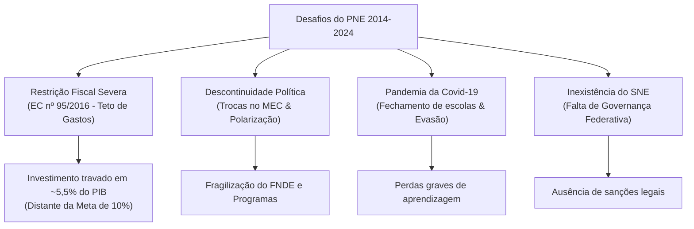
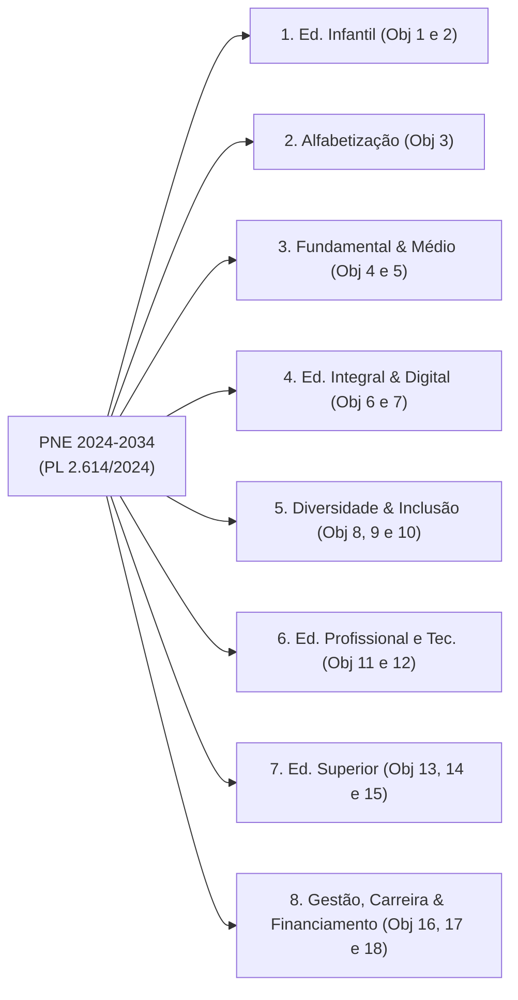

# Resumo Analítico: Plano Nacional de Educação (PNE)
### Balanço do PNE 2014-2024 e Análise do Projeto de Lei nº 2.614/2024 (PNE 2024-2034)

**Documento de Referência:** *Estudo Técnico: Plano Nacional de Educação – subsídios para análise do Projeto de Lei nº 2.614/2024*  
**Autoria Institucional:** Consultoria Legislativa da Câmara dos Deputados (Área XV – Educação, Cultura e Desporto)  
**Publicação:** Brasília, Março de 2025 | **Extensão:** 466 páginas  
**Equipe Técnica:** 12 Consultores Legislativos especialistas em políticas educacionais  
**Objeto Central:** Avaliação do decênio encerrado (Lei nº 13.005/2014) e análise propositiva e pormenorizada do Projeto de Lei do Executivo para o decênio 2024-2034.

---

## 1. Visão Geral e Contexto Político-Institucional do Documento

O arquivo `pne.pdf` não é apenas uma cópia da lei anterior, mas sim o **estudo técnico de maior envergadura produzido no Poder Legislativo brasileiro** para orientar a tramitação e aprovação do **novo PNE (2024-2034)**, formalizado pelo **Projeto de Lei nº 2.614/2024**.

O documento cumpre uma tríplice função:
1. **Balanço Diagnóstico:** Avalia com rigor técnico os sucessos, frustrações e gargalos do PNE 2014-2024 (Lei nº 13.005/2014);
2. **Exegese Normativa e Propositiva:** Analisa os 24 artigos do PL nº 2.614/2024 e disseca cada um dos **18 Objetivos Estruturais** distribuídos em **8 Grandes Temáticas**;
3. **Sustentabilidade Fiscal e Comparação Internacional:** Examina as fontes de financiamento (CAQi/CAQ, FUNDEB, Novo Arcabouço Fiscal) e extrai lições de planos educacionais de outros países em desenvolvimento (Colômbia, Índia e Moçambique).

---

## 2. Balanço Crítico do PNE 2014-2024 (Lei nº 13.005/2014)

O estudo realiza uma autópsia das razões pelas quais o decênio 2014-2024 teve a imensa maioria de suas metas descumpridas ou parcialmente atingidas:

### Principais Fatores do Descumprimento:
1. **Asfixia Fiscal e a EC nº 95/2016:** A aprovação do teto de gastos impôs um congelamento das despesas primárias por 20 anos e suspendeu o piso constitucional anterior. O gasto governamental médio por aluno no Brasil caiu **2,5% ao ano entre 2015 e 2021** (enquanto nos países da OCDE cresceu 2,1% ao ano).
2. **A Meta 20 Inalcançada:** A meta de destinar **10% do PIB** à educação pública foi completamente frustrada. O investimento público real estagnou na casa de **5,3% a 5,5% do PIB**.
3. **A Pandemia da Covid-19:** Causou o fechamento prolongado de escolas, acentuou o abismo da exclusão digital, elevou as taxas de evasão no Ensino Médio e comprometeu drasticamente o ciclo de alfabetização básica.
4. **Fragilidade Institucional e Falta de Sanções:** A não aprovação da lei complementar instituidora do **Sistema Nacional de Educação (SNE)** manteve o regime de colaboração frouxo. O PNE não possuía instrumentos judiciais ou sanções orçamentárias contra entes que descumprissem suas metas locais.
5. **O Ponto de Virada Positivo:** A aprovação do **Novo FUNDEB permanente (EC nº 108/2020 e Lei nº 14.113/2020)** impediu um colapso total da rede pública, elevando gradualmente a complementação da União de 10% para **23% até 2026** e introduzindo os critérios redistributivos de equidade (VAAT e VAAR).

---

## 3. A Nova Arquitetura do PNE 2024-2034 (PL nº 2.614/2024)

Diferente do plano anterior (que apresentava 20 metas numeradas de forma isolada), o PL nº 2.614/2024 adota uma modelagem mais orgânica e integrada:

* **Parte Normativa Expandida:** Passa de 14 para **24 artigos**, fixando conceitos no Art. 2º (*Diretrizes*, *Objetivos*, *Metas* e *Estratégias*).
* **As 10 Diretrizes Gerais (Art. 3º):** Visão sistêmica; intersetorialidade; promoção do desenvolvimento; pactuação federativa; equilíbrio entre responsabilidades e fluxo financeiro; pluralismo; qualidade com equidade; uso de evidências científicas; integração do ciclo de políticas públicas; e direitos humanos.
* **18 Objetivos Estruturais** agrupados em **8 Temáticas Sistêmicas**:

---

## 4. Detalhamento das 8 Temáticas e dos 18 Objetivos do PNE 2024-2034

### Temática 1 — Educação Infantil
* **Objetivo 1 (Acesso):** Ampliar a oferta de matrículas em **creches** (visando superar os 50% da população de 0 a 3 anos e zerar a fila de espera) e manter universalizada a **pré-escola** (4 e 5 anos).
* **Objetivo 2 (Qualidade):** Implementar parâmetros nacionais de infraestrutura e qualidade para a primeira infância (proporção adequada de crianças por educador, formação em pedagogia, espaços lúdicos, refeitórios e sanitários adaptados).

### Temática 2 — Alfabetização
* **Objetivo 3 (Alfabetização na Idade Certa com Equidade):** Garantir que 100% das crianças estejam **alfabetizadas ao final do 2º ano do Ensino Fundamental**.
  * Foco prioritário na redução das desigualdades de alfabetização entre crianças brancas, negras e indígenas, bem como entre regiões rurais e urbanas.
  * Alinhamento direto com o *Compromisso Nacional Criança Alfabetizada* (Decreto nº 11.556/2023).

### Temática 3 — Ensino Fundamental e Ensino Médio
* **Objetivo 4 (Trajetória e Conclusão):** Assegurar que os estudantes ingressem, permaneçam e concluam o Ensino Fundamental e o Ensino Médio na idade adequada.
  * Meta: Garantir que **95% dos jovens concluam o Fundamental até os 16 anos** e **o Médio até os 19 anos**.
  * Enfrentamento da distorção idade-série, reprovação em massa e abandono escolar.
* **Objetivo 5 (Aprendizagem com Equidade):** Elevação contínua dos índices de proficiência (SAEB) em Língua Portuguesa e Matemática, superando o foco exclusivo em médias gerais para focar na diminuição da disparidade entre os estratos socioeconômicos mais altos e mais baixos.

### Temática 4 — Educação Integral e Educação Digital
* **Objetivo 6 (Tempo Integral):** Oferecer educação em tempo integral em pelo menos **50% das escolas públicas**, atendendo no mínimo **25% dos alunos da Educação Básica**, em consonância com a Lei nº 14.640/2023 (*Programa Escola em Tempo Integral*).
* **Objetivo 7 (Conectividade e Cidadania Digital):** Garantir conectividade de alta velocidade para fins pedagógicos em todas as escolas públicas, acesso a equipamentos, formação dos professores para o uso de tecnologias e promoção da cidadania digital e pensamento computacional (Lei nº 14.533/2023 - PNED).

### Temática 5 — Diversidade e Inclusão
* **Objetivo 8 (Educação do Campo, Indígena e Quilombola):** Assegurar o direito à educação diferenciada, bilíngue e comunitária, com infraestrutura digna (energia, saneamento, internet) e materiais didáticos culturalmente contextualizados.
* **Objetivo 9 (Educação Especial Inclusiva e Bilíngue de Surdos):** Universalizar o atendimento aos educandos com deficiência, TGD e altas habilidades na rede regular com salas de recursos multifuncionais (AEE); e consolidar a modalidade de **Educação Bilíngue de Surdos** (Libras L1 / Língua Portuguesa L2, Lei 14.191/2021).
* **Objetivo 10 (Jovens, Adultos e Idosos - EJA):** Revitalizar a EJA, combatendo o analfabetismo funcional e ampliando em larga escala as turmas de EJA integradas à qualificação profissional técnica.

### Temática 6 — Educação Profissional e Tecnológica (EPT)
* **Objetivo 11 (Expansão de Matrículas):** Triplicar as matrículas da Educação Profissional Técnica de Nível Médio, assegurando gratuidade nas redes públicas e nos Institutos Federais (IFs).
* **Objetivo 12 (Qualidade da EPT):** Modernização de laboratórios e currículos alinhados às demandas do desenvolvimento regional sustentável, transição ecológica e indústria 4.0.

### Temática 7 — Educação Superior
* **Objetivo 13 (Acesso e Permanência):** Elevar a taxa bruta de matrícula para **50%** e a taxa líquida para **33%** da população de 18 a 24 anos.
  * Fortalecimento da Lei de Cotas (Lei nº 12.711/2012 com a redação da Lei nº 14.723/2023).
  * Política robusta de assistência estudantil (moradia, alimentação, bolsas permanência) para coibir a evasão no ensino superior público.
* **Objetivos 14 e 15 (Qualidade da Graduação e Expansão da Pós-Graduação):** Elevação dos padrões avaliativos do SINAES/ENADE; expansão da titulação anual para mestres e doutores com desconcentração geográfica da pesquisa acadêmica para o Norte, Nordeste e Centro-Oeste.

### Temática 8 — Gestão Democrática, Carreira e Financiamento
* **Objetivo 16 (Valorização dos Profissionais da Educação Básica):**
  * 100% dos professores com formação superior adequada à área em que lecionam;
  * Cumprimento e reajuste obrigatório do **Piso Salarial Profissional Nacional**;
  * **Equiparação do rendimento médio dos professores** ao dos demais profissionais de mesmo nível de escolaridade até o final do decênio;
  * Planos de carreira com jornada que reserve 1/3 do tempo para planejamento e estudo.
* **Objetivo 17 (Gestão Democrática e Participação Social):**
  * Efetivação dos **Conselhos Escolares** paritários e deliberativos e dos **Fóruns dos Conselhos Escolares** (Lei nº 14.644/2023);
  * Superação da indicação política para diretores escolares, priorizando critérios de mérito técnico e consulta pública/eleição pela comunidade.
* **Objetivo 18 (Financiamento e Padrão de Infraestrutura Escolar):**
  * Eliminar escolas com carência de infraestrutura básica (fornecimento regular de água tratada, energia elétrica, esgotamento sanitário, banheiros adequados, acessibilidade, bibliotecas, laboratórios e quadras cobertas);
  * Implementação definitiva do **Custo Aluno-Qualidade (CAQi/CAQ)**.

---

## 5. Financiamento e Sustentabilidade Fiscal no PL 2.614/2024

A Seção 5 do estudo técnico aborda a viabilidade econômica do novo PNE diante do cenário de regras de controle fiscal:

1. **O Desafio do CAQi e do CAQ:**
   * O **Custo Aluno-Qualidade Inicial (CAQi)** e o **Custo Aluno-Qualidade (CAQ)** definem a matriz de insumos materiais, estruturais e humanos essenciais para uma educação digna. O estudo aponta que, apesar de previstos na CF/88 e na Lei do Novo FUNDEB, a sua regulamentação efetiva é o maior nó górdio para equalizar o investimento educacional entre municípios ricos e pobres.
2. **Convivência com o Novo Arcabouço Fiscal (Lei Complementar nº 200/2023):**
   * O estudo adverte que as metas educacionais exigem aumento progressivo de despesas públicas. A compatibilização entre os limites de expansão de gastos federais previstos na LC 200/2023 e as demandas do PNE exigirá a blindagem das vinculações de receitas de impostos e a preservação dos aportes suplementares da União ao FUNDEB.

---

## 6. Perspectiva Internacional e Lições Comparadas

O estudo técnico analisa a experiência de três países que enfrentaram transições complexas em seus sistemas de planejamento educacional:

| País / Plano | Foco Estratégico | Boas Práticas e Lições para o Brasil |
| :--- | :--- | :--- |
| **Colômbia** *(PNDE 2016-2026)* | Educação como pilar de construção da paz, cidadania e convivência democrática pós-conflito armado. | Forte governança descentralizada, monitoramento regional por comissões locais e participação cidadã ativa nas avaliações intermediárias. |
| **Índia** *(NEP 2020)* | Reestruturação pedagógica global (modelo 5+3+3+4), multilinguismo e equidade digital massiva. | Investimento agressivo em infraestrutura tecnológica e foco rigoroso nas competências básicas de alfabetização e numeramento nos primeiros anos. |
| **Moçambique** *(PEE 2020-2029)* | Universalização do ensino primário gratuito, retenção de meninas na escola e expansão da formação docente. | Alinhamento direto entre os compromissos do plano e a dotação no orçamento de curto prazo (LOA), evitando metas sem fonte garantida. |

---

## 7. Recomendações Críticas da Consultoria Legislativa da Câmara

Para evitar que o PNE 2024-2034 repita o fracasso de implementação do decênio anterior, os consultores legislativos propõem aperfeiçoamentos essenciais ao texto do PL nº 2.614/2024:
1. **Pactuação Federativa Vinculante:** Urgência inadiável de aprovar a lei complementar do **Sistema Nacional de Educação (SNE)** para coordenar as responsabilidades de União, Estados e Municípios e evitar a sobreposição ineficiente de ações.
2. **Orçamento Carimbado no PPA, LDO e LOA:** Obrigatoriedade de que cada meta do PNE tenha correspondência explícita e dotações asseguradas nos instrumentos do ciclo orçamentário plurianual e anual dos entes federativos.
3. **Mecanismos de Monitoramento Contínuo:** Fortalecimento do monitoramento bianual pelo INEP, com painéis de dados abertos e indicadores claros de equidade (desagregados por renda, cor/raça, gênero e localidade).
4. **Resgate da Avaliação Formativa e Institucional:** Garantir que as avaliações nacionais de larga escala (SAEB) não sejam transformadas em instrumentos de punição ou ranqueamento predatório de redes, mas em diagnósticos orientadores da assistência técnica e financeira da União às escolas mais vulneráveis.
